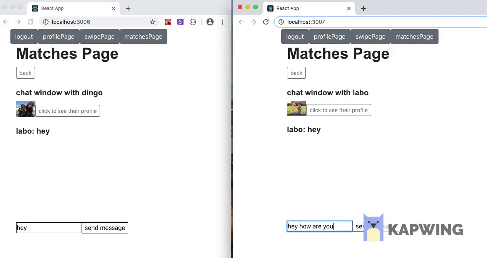

# first-chat-project
PetPal backend (Node JS/ React JS/ Jest/ MongoDB/ Express/ Mongoose).
A full stack web application, designed to help dog owners find play dates for their dogs.(Tinder style interface)

Link to recorded demo: https://www.youtube.com/watch?v=Gfyzbo2OnP0

-Implemented TTD for backend with Jest testing framework.
-Utilized Socket.io to implement real time functionality for messaging and matches.
-MVC design pattern and RESTful routes.
-Employed validation using JWT.

To test this application;
1. Please start up MongoDB.
2. In the terminal enter "npm run seed" for seed data. (you should see the console log "done seeding").
3. Once you see "done seeding", please close that process and run "npm run dev".
4. Now that the backend is up and running please navigate to the frontend repository, link bellow, and run from there.
-frontend: https://github.com/hs21hs/frontend-chat-project
5. Note- it is suggested to login with seeded user "l@hotmail.com", and to test chat features login a second time with "d@hotmail.com". Password for both users is "default123".
(if you choose to sign up a new user and do not provide an image url it will give you a default profile picture).

Thank You!

